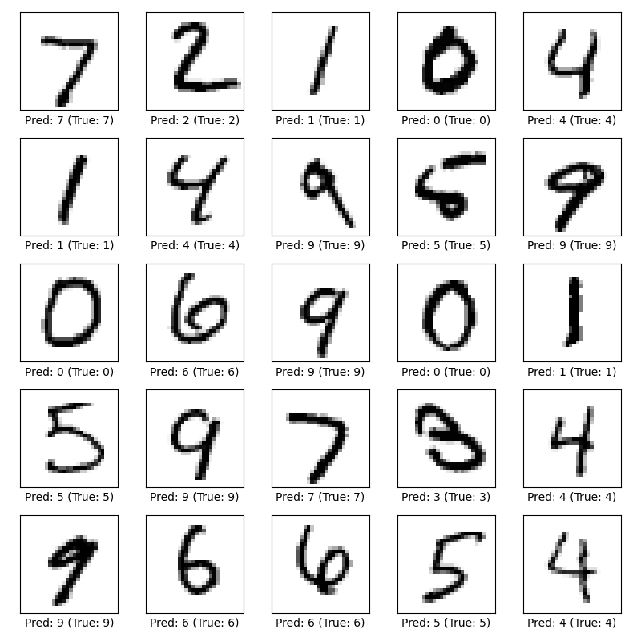
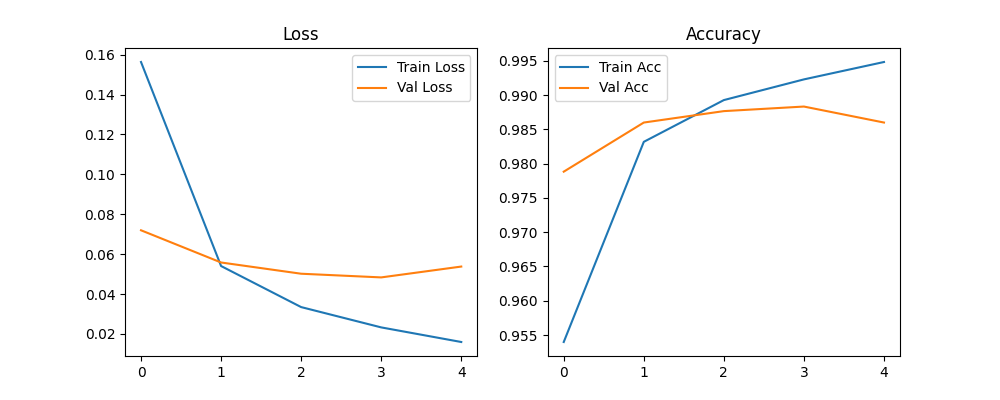

# MNIST Digit Recognizer

A deep learning project to recognize handwritten digits (0–9) using the MNIST dataset and a Convolutional Neural Network (CNN) built with TensorFlow/Keras.

---

## Features
- Preprocessing of image data (normalization, reshaping)
- Training a CNN with 32 convolution filters
- Achieves ~98% test accuracy
- Prediction visualization on sample digits
- Model saved as `model.h5`

---

## Project Structure

src/
├── mnist_train.py # Train the model
└── mnist_predict.py # Run predictions and generate sample images
outputs/
├── model.h5 # Trained model
├── training_history.png # Training loss/accuracy graphs
└── sample_predictions.png # Prediction visualization

---

## Results
### Sample Predictions


### Training History


---


## Installation
```bash
pip install -r requirements.txt
```
## Run
```bash
python src/mnist_train.py
python src/mnist_predict.py
```

---

## License
This project is licensed under the MIT License.
